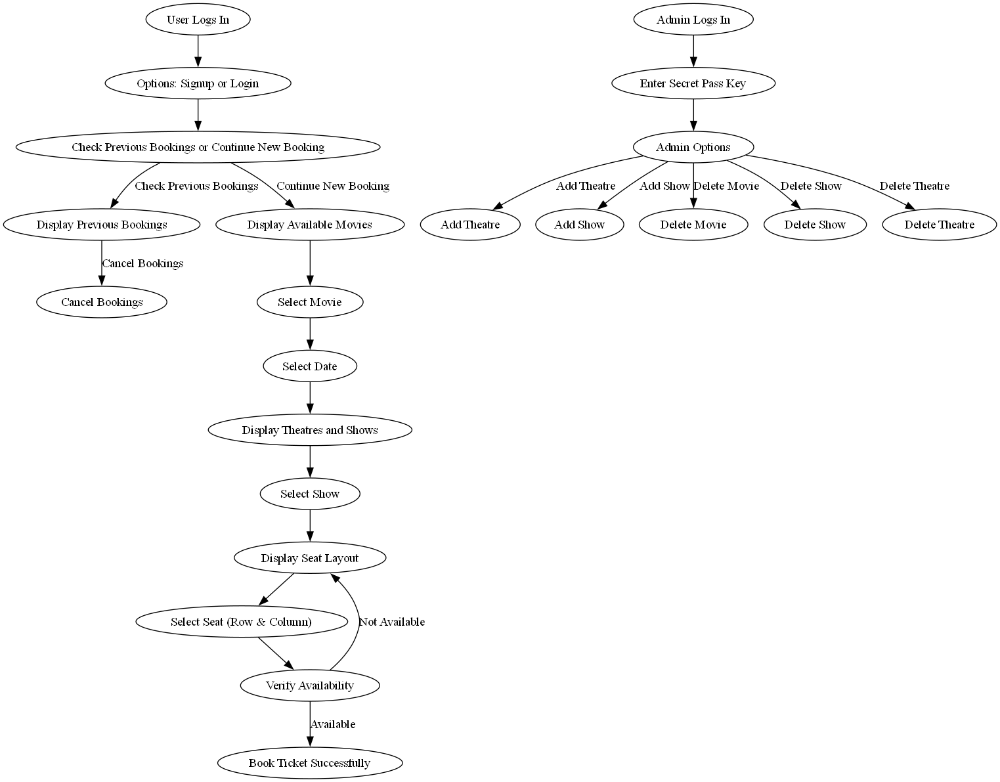

# **Movie Ticket Booking System**

## **Team Details**

| Name | Roll No | Email |
|------|---------|-------|
| SVN Sai Sathvik | IMT2023001 | SVN.Sathvik@iiitb.ac.in |
| Kh Sudhir | IMT2023546 | Kh.Sudhir@iiitb.ac.in |
| Kasam Likith | IMT2023573 | Likith.Kasam@iiitb.ac.in |
| K Jitin | IMT2023057 | KVS.Jitin@iiitb.ac.in |
| Sai Ganesh | IMT2023525 | Ganesh.Upadrasta@iiitb.ac.in |
| Kapil Aditya Reddy | IMT2023052 | KKR.Aditya@iiitb.ac.in |

## **Project Overview**

The Movie Booking System is a terminal-based application developed to streamline the process of booking movie tickets. Leveraging the interoperability between C++ and Java via JNI, the system provides an efficient and modular design for managing user profiles, available movies, seat selection, and ticket bookings. This implementation ensures simplicity and functionality.

## **Scope**

### **Current Scope**

**Core Features:**
- Displaying available movies and showtimes
- User registration and authentication for secure access
- Seat selection and ticket booking through a terminal-based interface
- Generating and displaying booking receipts

**Technology Integration:**
- Combining C++ for backend logic with Java for the main interface using JNI (Java Native Interface)
- Streamlined execution of cross-language function calls to achieve modular and efficient operations

### **Future Scope**
- Transition to a Graphical User Interface (GUI) for enhanced user experience
- Integration of real-time payment systems and e-wallet support
- Implementation of cloud-based data storage for scalability and multi-user operations
- Expansion to support multiple concurrent users and advanced ticketing options
- Development of features for personalized recommendations based on user history

## **Objectives**

The main objectives of this project are:

1. **Streamline the Movie Ticket Booking Process:**
   - Develop an efficient system for browsing available movies, selecting seats, and booking tickets

2. **Leverage Language Interoperability:**
   - Utilize C++ for backend logic and Java for the main interface, connected via JNI, to demonstrate the effective integration of two programming languages

3. **Provide a Modular Design:**
   - Create a system with well-structured modules for user management, movie management, and booking functionalities, ensuring clarity and scalability

4. **Ensure System Efficiency:**
   - Design a terminal-based interface that minimizes resource usage while maintaining functionality

5. **Demonstrate Practical Application of Concepts:**
   - Showcase proficiency in object-oriented programming, file handling, and JNI integration for real-world problem-solving

## **System Overview**

### **Technical Specifications**

**Programming Languages:**
- **Java:**
  - Used for the main function and user interaction
  - Handles the terminal-based interface and orchestrates calls to the backend

- **C++:**
  - Used for implementing backend logic
  - Manages core operations like data processing, ticket booking, and database management

- **JNI (Java Native Interface):**
  - Bridges communication between Java and C++

## **Input/Output Requirements**

### **Input Requirements:**
- **User Inputs:**
  - Movie selection (e.g., movie title or ID)
  - Theatre And Show Selection based on date filter
  - Seat selection (e.g., row and seat number)
  - Personal details for booking confirmation

- **Administrative Inputs:**
  - Movie schedule and details (title, duration, available seats)
  - Updates to movie availability or pricing
  - Adding theatre details

### **Output Requirements:**
- **User Outputs:**
  - Display of available movies and showtimes
  - Seat layout and availability
  - Confirmation message with ticket details (movie name, time, seat number)

- **Administrative Outputs:**
  - Updated movie schedules
  - Logs of completed bookings for record-keeping

## **Detailed Features and Use Cases**

### **User Management**
- **Features:**
  - Secure user registration and login
  - Profile management with access to booking history

- **Use Cases:**
  - **User Registration:**
    - Actor: User
    - Flow: User registers with credentials, which the system validates and stores

  - **Login:**
    - Actor: User
    - Flow: User logs in with email and password for access to features

### **Movie Management**
- **Features:**
  - Display available movies with schedules
  - Search and filter movies by genre or language

- **Use Cases:**
  - **View Movies:**
    - Actor: User
    - Flow: User browses the list of movies with details provided by the system

  - **Filter Movies:**
    - Actor: User
    - Flow: User applies filters to refine movie selection

### **Booking System**
- **Features:**
  - Select seats from available options
  - Generate and display booking confirmation

- **Use Cases:**
  - **Book Tickets:**
    - Actor: User
    - Flow: User selects a movie, chooses seats, and confirms the booking

  - **Cancel Booking:**
    - Actor: User
    - Flow: User cancels an existing booking from "My Bookings"

### **Administrative Features**
- **Features:**
  - Add, update, or remove movies
  - Maintain booking logs for record-keeping

- **Use Cases:**
  - **Add a Movie:**
    - Actor: Administrator
    - Flow: Admin logs in, adds movie details, and updates the schedule

### **Error Handling**
- **Features:**
  - Validate inputs and prevent duplicate bookings
  - Display appropriate error messages

- **Use Cases:**
  - **Handle Invalid Input:**
    - Actor: User
    - Flow: System identifies and prompts for correction when an invalid input is entered

## **Non-functional Requirements**

### **Performance:**
The system is designed to handle operations efficiently in a terminal-based environment, with quick response times for user actions like seat selection and booking confirmation.

### **Scalability:**
Provides a modular structure, making it easy to scale the system for future enhancements, such as adding more functionalities or transitioning to a graphical interface.

### **Interoperability:**
Demonstrates seamless interaction between Java and C++ through JNI, ensuring smooth communication between the interface and backend logic.

### **Maintainability:**
The system uses modular code design, making it easier to debug, update, and enhance specific components like movie management or seat selection.

### **Extensibility:**
Built with a foundation that supports future additions, such as integration of payment systems, GUI, and real-time database support.

## **Development Setup**

### **Languages and Technologies:**
- **C++**: Core backend logic (core.cpp, core.so)
- **Java**: Frontend and integration via JNI (BookYourShow.java)

### **Key Components:**
- Text Files: (Customers.txt, movies.txt, Theatres.txt) store customer data, movie listings, and theatre details
- Shared Libraries:
  - core.so (Linux) / BookYourShow.dll (Windows): Links Java with C++ backend
- Diagrams: UML design

## Build & Run Instructions

### Prerequisites
- Java Development Kit (JDK)
- G++ Compiler
- Git (for cloning the repository)

### Installation Steps

#### Clone the Repository
  git clone [https://github.com/svnsaisathvik/CPP-Project/edit/main/Readme.md]
  cd [CPP-Project]
#### Compile Java Code
##### Compile the Java file
  javac BookYourShow.java

##### Generate JNI header file
  javac -h . BookYourShow.java

##### Build Native Library For Windows:
   g++ -shared -o BookYourShow.dll core.cpp -I"%JAVA_HOME%/include" -I"%JAVA_HOME%/include/win32"

##### Build Native Library for Linux/Mac:
   g++ -shared -fpic -o libnumberGame.so numberGame.cpp I"$JAVA_HOME/include" -I"$JAVA_HOME/include/linux"

##### Run the Application:
   java -Djava.library.path=. BookYourShow

  

## **Workflow**

### **Flow Chart**

The workflow diagram illustrates the system's process flow, showing the interactions between different components of the Movie Ticket Booking System, including:
- User registration and login
- Movie selection process
- Seat booking workflow
- Ticket confirmation steps
- Administrative operations
## **Important Files & Folders**

### **Key files:**
- **BookYourShow.java:**
  - Contains the main Java application logic and user interface for the terminal
  - Acts as the entry point of the program

- **core.cpp:**
  - Implements the core backend logic for movie and seat management in C++
  - Used for performance-critical operations

### **Data Files:**
- **Customers.txt:** Stores user information, login credentials, and booking history
- **movies.txt:** Contains details about available movies, titles, genres, and showtimes
- **Theatres.txt:** Holds information about theaters, including seating arrangements and availability

## **Testing & Logging**

We will implement unit tests for the core classes (Movie, Show, Seat, Booking) and use logging mechanisms to record booking failures and payment errors.

## **Conclusion**

This project aims to develop a user-friendly movie ticket booking system with real-time seat availability, secure payment, and efficient booking confirmation. We expect to deliver a robust system that simplifies the movie ticket booking process for users.
